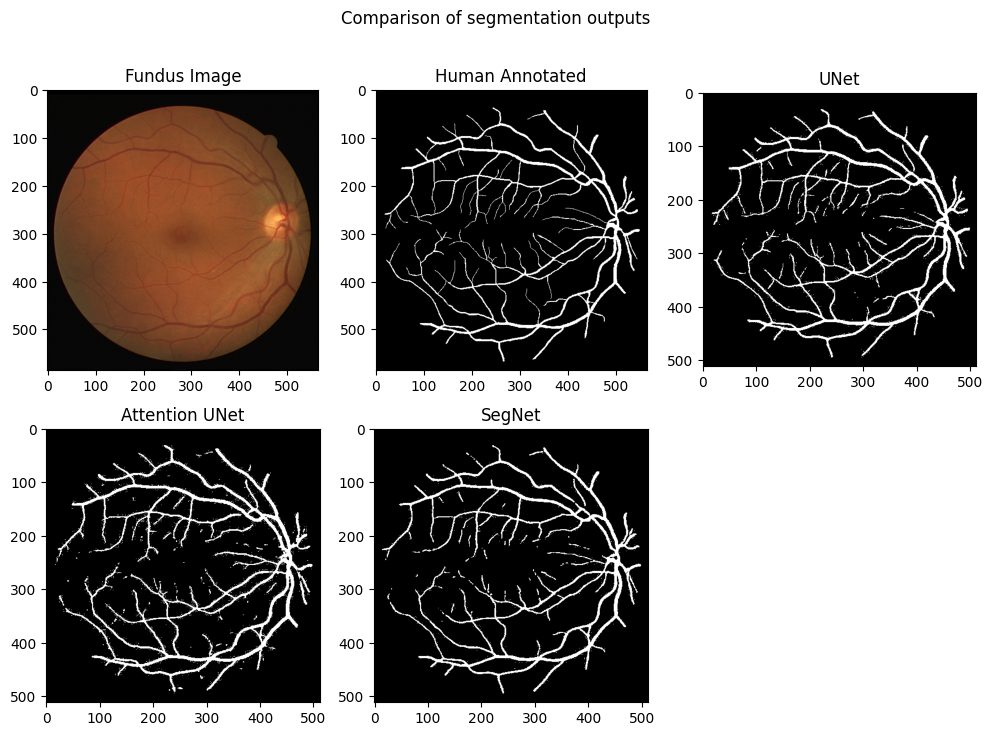

# Retinal Blood-Vessel Segmentation



## **Running on local machine**

To set up the project, you will need to have Python 3.7 or above and Poetry installed on your machine.

Clone the repository to your local machine:

```bash
git clone https://github.com/rumbleFTW/retinal-segmentation.git
cd retinal-segmentation
```

Navigate to the project directory:

```bash
cd poetry-project
```

Install the dependencies using Poetry:

```
poetry install
```

Once the dependencies are installed, you can activate the venv by using the following command:

```bash
poetry shell
```

## **Training**

To train models, run the following command in the terminal:

```bash
python training.py --data /path/to/data --network att_unet --device cuda
```

**Arguments**

- `--data`: (required) The path to the data folder.
- `--network`: (required) The network type to use. Available options are `att_unet`, `unet` &, `seg_net`.
- `--device`: (optional) The device to use. Default is `cpu`.

**Example**

Here's an example of training an `AttentionUNet` Network on `cuda`:

```bash
python training.py --data ./DRIVE --network att_unet --device cuda
```

## **Testing**

To test images, run the following command in the terminal:

```bash
python test_network.py --img /path/to/image.jpg --network unet --device cpu --checkpt /path/to/checkpoint.pth
```

**Arguments**

- `--img`: (required) the path to the image to test.
- `--network`: (required) the type of neural network to use for testing. Available options include att_unet, unet, and seg_net
- `--device`: (optional) the device to use for testing, default is "cpu".
- `--checkpt`: (required) the path to the checkpoint .pth file.
